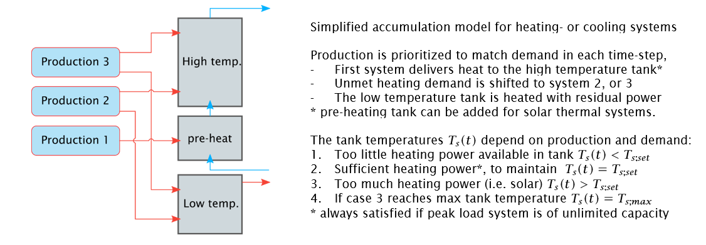

# Building energy calculations according to SN/TS 3031:2016
Kristian Skeie 2019-03
## Introduction
Building energy system calculations for early design and operation according to SN/TS 3031:2016.

Concept of the heat storage model.

